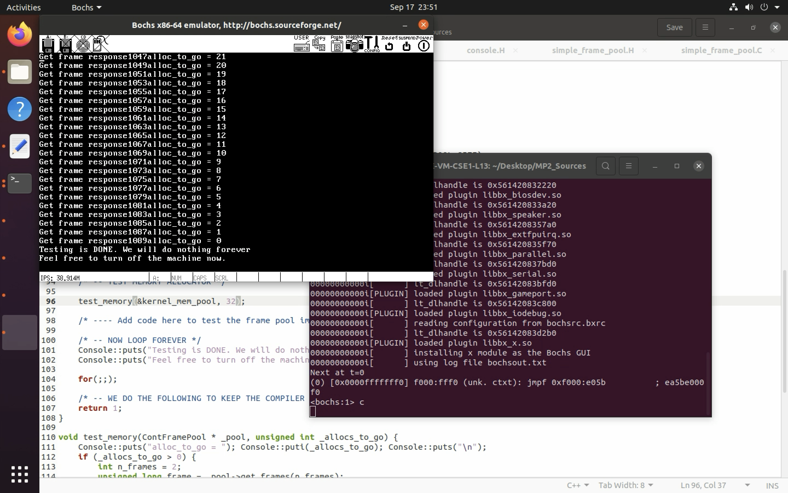
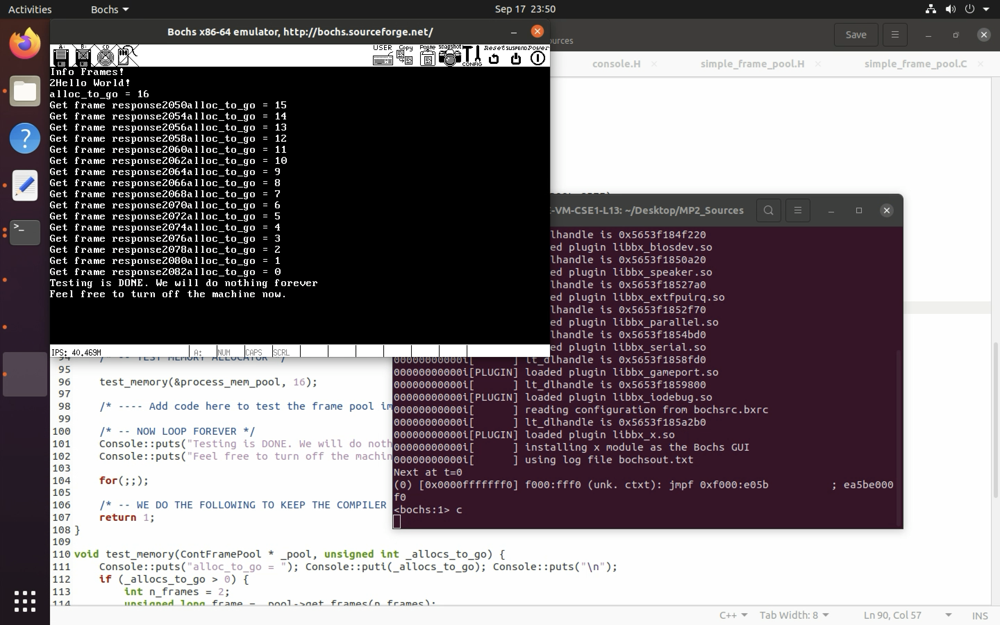

### Design Document 


The following project has frame manager implemented using 5 functions


Class ContFramePool allocates continuous frames -> 

1. Constructor -> 
    `base_frame_no` -> denotes the base frame number of the pool 
    `_n_frames` -> total number of frames accomodated by the pool 
    `_info_frame_no` -> start of the frame information frame, frame information is within the respective frame pool and can be either 0, 1 st frame or any frame numbee within pool


Frame information is stored as `char` -> F, U , H denotes Free Used and HoS. static function `needed_info_frames` calculations are done accordingly. 

```
     Here we have 3 states for each frame, so two bits each. i.e each frame would require 8 bits each for representation.
     _n_frames will require (_n_frames * 8) bits. each frame can manage 4K*8 bits i.e 32k bits. Number of frames requires = (_n_frames*8/32k)+ (_n_frames%4k > 0 ? 1:0)

     Example. If _n_frames = 2, then we will need 8 bits i.e one frame round of. If we 4k frames i.e we need 32k bits to represent which is accomodated by 1 frame which has 32k bits.

     _n_frames is equal to 17k, so we need 17*2k bits to represent i.e 34k bits. Each frame can represent 32k bits and to accomodate 34k bits we need 2 frames and from formula above we get (1 + 1= 2 ) frames

```


#### Initialisations
1. static array of ContFramePools to store all the Pools created, here 2.
2. Set all frames within pool as `Free` except the Frames used for pool management, which are set to   `Used`
3. A char bitmap to store the states and pointing to its frame for management of pool


#### Functions 

1. private function `get_state` -> takes the frame number and return the state by looking into bitmap
2. private function `set_state` -> takes the frame number and state that needs to be set to. bitmap is updated on the basis of given state
3. `get_frames` -> allocates  `n_frames` continuous frames 

design -> Traverses through all the non-Free frames and stopes as soon as it finds a Free frame,  for instance `f1`. it further travereses for `n_frames` and checks if all are free along with the check of being within the pool. If yes, it sets all the `n_frames` to Used and first frame to `HoS`. 

4. mark_inaccessible -> all frames within the given limits is marked Used 

5. static function `release_frames` 
    input args -> array of pools, kernel and process. and frame number(not pool scoped)
    this function first finds the pool, the frame is part of then calls private function `within_pool` 

6. `within_pool` -> This first checks if the first frame is `HoS`. If yes, it updates all `Used` frames and first frame to `Free` 


7. static function `needed_info_frames` -> calculates the number of frames needed to manage the pool 


### Testing 


1. We have 2 pools, kernel and process with their respective base frame and frame size. kernel.C was execeuted to `get_frames` and subsequently `release_frames`





